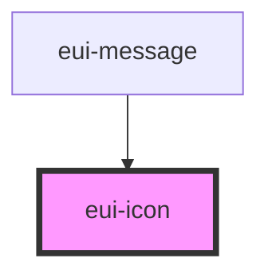

# eui-icon

<!-- Auto Generated Below -->

## Properties

| Property         | Attribute          | Description                                                 | Type      | Default     |
| ---------------- | ------------------ | ----------------------------------------------------------- | --------- | ----------- |
| `nzIconfont`     | `nz-iconfont`      | Type of the icon from iconfont                              | `string`  | `undefined` |
| `nzRotate`       | `nz-rotate`        | Rotate degrees                                              | `string`  | `undefined` |
| `nzSpin`         | `nz-spin`          | Rotate icon with animation                                  | `boolean` | `undefined` |
| `nzTheme`        | `nz-theme`         | Type of the ant design icon                                 | `string`  | `undefined` |
| `nzTwotoneColor` | `nz-twotone-color` | Only support the two-tone icon. Specific the primary color. | `string`  | `undefined` |
| `nzType`         | `nz-type`          | Type of the ant design icon                                 | `string`  | `undefined` |

## Dependencies

### Used by

 - [eui-message](../message)

### Graph

----------------------------------------------

*Built with [StencilJS](https://stenciljs.com/)*
