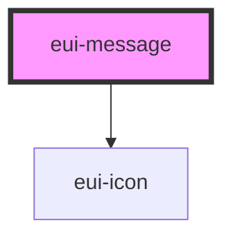

# eui-message

<!-- Auto Generated Below -->

## Properties

| Property         | Attribute           | Description                                                            | Type                                                       | Default     |
| ---------------- | ------------------- | ---------------------------------------------------------------------- | ---------------------------------------------------------- | ----------- |
| `content`        | `content`           |                                                                        | `string`                                                   | `undefined` |
| `nzAnimate`      | `nz-animate`        | Whether to turn on animation                                           | `boolean`                                                  | `true`      |
| `nzDirection`    | `nz-direction`      | Direction of the text in the messages                                  | `"ltr" \| "rtl"`                                           | `'ltr'`     |
| `nzDuration`     | `nz-duration`       | Duration (milliseconds), does not disappear when set to 0              | `number`                                                   | `3000`      |
| `nzMaxStack`     | `nz-max-stack`      | The maximum number of messages that can be displayed at the same time  | `number`                                                   | `7`         |
| `nzPauseOnHover` | `nz-pause-on-hover` | Do not remove automatically when mouse is over while setting to `true` | `boolean`                                                  | `true`      |
| `nzTop`          | `nz-top`            | Distance from `top`                                                    | `number \| string`                                         | `24`        |
| `nzType`         | `nz-type`           |                                                                        | `"error" \| "info" \| "loading" \| "success" \| "warning"` | `undefined` |

## Dependencies

### Depends on

- [eui-icon](../icon)

### Graph

----------------------------------------------

*Built with [StencilJS](https://stenciljs.com/)*
